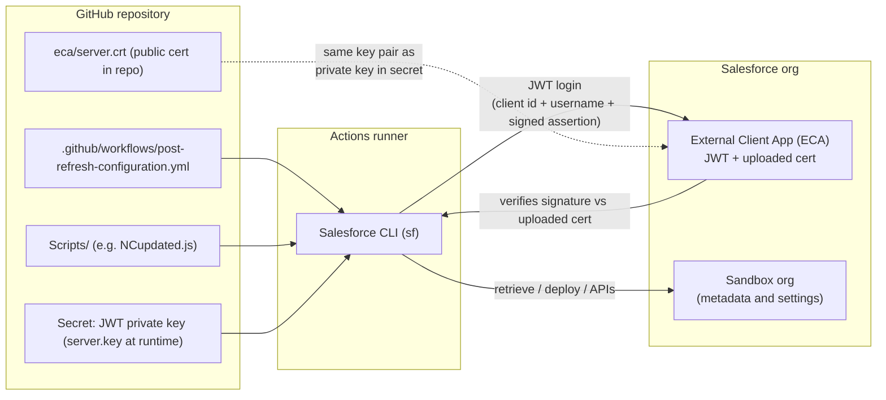

# Sandbox refresh automation — setup guide

This document explains how the **sandbox refresh post-configuration** automation works: how GitHub Actions connects to Salesforce, what lives in `.github` and `Scripts/`, how the **External Client App (ECA)** and certificates fit in, and how to **maintain** secrets, variables, and API versions safely.

---

## Who needs access to maintain this?

People who change workflows, scripts, or GitHub **Actions** configuration need sufficient rights on the **GitHub repository** and the **Salesforce org**.

**GitHub (recommended minimum: Maintain)**  
Assign collaborators (or team access) at least the **Maintain** role for this repository. In GitHub’s access model, **Maintain** allows reading, cloning, and pushing, and includes **some repository settings**—which is what you need to manage **Actions secrets and variables**, workflow files, and branch protection–related settings without full **Admin**.

**Salesforce**  
Whoever provisions the **External Client App**, uploads the **certificate**, and grants the integration user the right permissions needs appropriate **Salesforce admin** access in each target org (or a documented handoff with an admin).

Place this requirement next to maintenance tasks because **secrets and variables** are edited under **Settings → Secrets and variables → Actions**; without Maintain (or Admin), those pages are read-only or inaccessible.

---

## High-level flow

The workflow runs in **GitHub Actions**. It installs the Salesforce CLI (`sf`), authenticates to the org using **JWT bearer flow**, then applies **retrieve → update → deploy** (and a few specialized paths) so the refreshed sandbox is safe and pointed at non-production endpoints.

**Authentication (JWT) in plain terms**

1. In Salesforce, an **External Client App** has **JWT Bearer Flow** enabled and the **public** certificate uploaded (see [ECA and `server.crt`](#eca-and-servercrt-external-client-app)).
2. In GitHub, the **private** key is stored as a secret (for example `SF_JWT_KEY`). The workflow writes it to a file (for example `server.key`) with restricted permissions.
3. The runner runs `sf org login jwt` (or equivalent) using the **consumer key** (from the ECA), **integration user username**, **private key file**, and **login/instance URL** (for sandboxes, typically `https://test.salesforce.com`).
4. Salesforce validates the JWT against the **public** cert on the app. The CLI then uses the authenticated session for **metadata retrieve/deploy**, **REST**, and **Tooling** calls.

---

## What lives under `.github`?

| Path | Purpose |
|------|--------|
| `.github/workflows/post-refresh-configuration.yml` | Main workflow: environment setup, Salesforce JWT auth, validation, metadata retrieve/update, optional API-based steps, deploy, and job summary. |
| `.github/CODEOWNERS` | (If present) Defines who must review changes to sensitive paths; keep in sync with your team’s ownership model. |

The workflow is the **orchestration layer**: it pins tool versions (for example Node for CLI install), wires **secrets** and **variables** into steps, and sequences **conditional** steps (often driven by `workflow_dispatch` inputs like `enable_sf_credentials`, `update_named_credentials`, etc.—exact names are in the YAML).

---

## Scripts (`Scripts/`)

### `NCupdated.js` — Named Credential URL updates

**What it does:** After metadata is retrieved into `force-app/main/default`, this Node script finds `*.namedCredential-meta.xml` files and rewrites **endpoint URLs** for both **legacy** Named Credentials (for example `<endpoint>` with `<principalType>`) and **next-gen** Named Credentials (parameters such as `Url` in `namedCredentialParameters`).

**Why it exists:** A sandbox refresh copies **production** Named Credential endpoints. Those URLs must be rewritten to **non-production** (or pilot) hosts so integrations do not call production systems. The script centralizes complex XML handling that would be fragile in pure shell.

**Configuration (typically from GitHub Actions variables/secrets):**

- **`IGNORE_LIST`** — Comma- or newline-separated Named Credential developer names to **skip**.
- **Explicit URL map** — A JSON map of credential name → URL (repository uses a secret such as `NAMED_CREDENTIALS_EXPLICIT_URLS` in the workflow; treat values as sensitive).

The script may also apply **automatic host rewrites** (for example production → pilot patterns) and **safety** behavior (for example altering hosts when the name suggests `_production`)—see the script header comments for the authoritative rules.

**Dependencies:** Installed on the runner (for example `glob`, `xml2js` via `npm install` in the workflow).

---

## ECA and `server.crt` (External Client App)

**ECA** here means Salesforce **External Client App** (the modern surface for connected-app–style OAuth settings used with JWT).

**Certificate split**

- **`eca/server.crt`** in the repository is the **public** certificate (or the public half of the key pair) that you upload to the ECA.
- The matching **private** key must **not** be committed to the repo. It is stored only as a GitHub **secret** (for example `SF_JWT_KEY`) and written to a temporary file during the workflow.

**What you do in Salesforce**

1. Create or open the **External Client App** used for CI (for example “Github actions app”).
2. Enable **JWT Bearer Flow** (sometimes shown as “Enable JWT Bearer Flow” / certificate-based JWT).
3. Upload **`server.crt`** in the app’s **certificate** field (exact label may vary slightly by UI version).
4. Note the app’s **consumer key** → maps to GitHub secret such as **`SF_CLIENT_ID`**.
5. Ensure the **integration user** (`SF_USERNAME` secret) is authorized for this app and has the permissions required by the workflow (metadata, settings, Tooling/REST as needed).
6. Select OAuth scopes appropriate for automation (your org’s security standards apply). JWT server-to-server flows typically need offline/refresh-style access where policy allows.

**Operational note:** If you rotate keys, generate a new pair, update **`eca/server.crt`** in git (public), update the **secret** with the new private key, and re-upload the new public cert to the ECA.

---

## Workflow steps — what each does and why

Below is the **intent** of each major class of step. Exact step names, order, and `if:` conditions are defined in `post-refresh-configuration.yml`; use that file when implementing changes.

### Bootstrap and safety

| Step / area | What it does | Why |
|-------------|----------------|-----|
| Install Node / Salesforce CLI | Provides `sf` and tooling on the runner | Reproducible automation without a local developer machine |
| Write JWT private key to disk | Materializes the secret as `server.key` (locked down) | JWT signing for headless login |
| `sf org login jwt` + default alias (e.g. `cicd-org`) | Establishes authenticated CLI session | All subsequent CLI/API calls run as the integration user |
| Verify org / capture `org.json` | Confirms connectivity and stores instance metadata | Debugging and REST/Tooling calls that need tokens and host |
| Org validation / guardrails | May block runs against unintended orgs | Prevents destructive changes on the wrong instance (see YAML for exact rules) |
| Ensure `force-app/...` exists | Creates project layout if missing | Retrieve/deploy expects standard DX paths |

### Retrieve (bulk metadata)

| Step / area | What it does | Why |
|-------------|----------------|-----|
| `sf project retrieve start` for Networks, SAML SSO, Security-related settings, etc. | Pulls current metadata into `force-app` | **Retrieve** phase of retrieve–update–deploy; baseline for edits |

### Update settings (mostly XML / sed + validation)

These steps edit retrieved **Settings** metadata (or related XML) to match **sandbox-safe** posture after a refresh from production.

| Step / area | What it does | Why |
|-------------|----------------|-----|
| Enable Salesforce credential login | Flips security settings so username/password login works where SSO was copied | SSO/SAML from prod often breaks or is undesirable in sandboxes |
| Set max login attempts | Sets lockout policy (e.g. to `10`) | Aligns security posture with non-prod expectations |
| Disable Outlook integration | Turns off email integration features | Avoids unintended integration with mail systems |
| Disable Identity Provider | Disables IdP features copied from prod | Reduces security surface and mis-routed auth |
| Enable Lightning S1 banner preference | Adjusts Lightning Experience banner setting | UX/policy for non-prod |
| Deactivate Communities | Deactivates Experience Cloud sites as configured | Prevents public/community endpoints from behaving like prod |
| Uninstall managed package (e.g. Smarsh) | Removes specific managed packages when required | Keeps sandbox aligned with allowed footprint |
| Delete SAML SSO configurations | Removes SSO configs | Prevents accidental prod IdP usage |
| Disable Box trigger / similar | Disables specific automation | Stops integrations that should not run in sandbox |
| Update Remote Site Settings | Rewrites remote site URLs to pilot/non-prod hosts | Callouts must not hit production gateways |
| Remove all certificates (destructive deploy) | Queries certs, builds `destructiveChanges.xml`, deploys deletion | Clears production certs that should not remain in lower envs |

### API- or script-based updates (when deploy alone is awkward)

| Step / area | What it does | Why |
|-------------|----------------|-----|
| Deactivate `SCA_Exceptions` flow (Tooling API) | Finds flow definition and sets active version to **0** / deactivates | Faster or clearer than metadata deploy for some flows |
| Update Email Relay username (REST) | Queries Email Relay records and PATCHes username (uses variable e.g. `EMAIL_RELAY_USERNAME`) | Data/setting not always best handled purely via metadata in one shot |
| `NCupdated.js` | Rewrites Named Credential endpoints | Handles legacy + next-gen credential XML consistently |

### Deploy and report

| Step / area | What it does | Why |
|-------------|----------------|-----|
| `sf project deploy start --source-dir force-app` | Pushes consolidated metadata changes | **Deploy** phase of retrieve–update–deploy |
| Post-deploy org display / summary | Writes GitHub Step Summary with per-step status | Operators see what succeeded, skipped, or failed in one view |

---

## Maintenance table

### GitHub Actions — **repository variables**

Repository variables are **non-secret** configuration (still protect them—do not put passwords here). Typical examples used by this automation:

| Variable | How to maintain |
|----------|------------------|
| `BASE_DOMAIN` | Update when org or domain naming conventions change and scripts reference it. |
| `EMAIL_RELAY_USERNAME` | Set to the **non-production** identity the Email Relay step should use after refresh. |
| `IGNORE_LIST` | Comma-/space-separated list of Named Credential names **not** to rewrite in `NCupdated.js`. |
| `PKG_NAMESPACE` | Managed package namespace for steps that uninstall or target a specific package (e.g. Smarsh). |
| `PLATFORM_EVENTS_LIST` | List of platform events for enable/disable or related automation—keep in sync with metadata reality. |
| `TSP_DISABLE_LIST` | Transaction Security Policy or related disable list—adjust when org policies change. |

**Where:** GitHub → **Settings → Secrets and variables → Actions → Variables** (repository or environment scope, depending on how your org configured the workflow).

### GitHub Actions — **secrets**

| Secret | How to maintain |
|--------|------------------|
| `SF_JWT_KEY` | Private key PEM for JWT; rotate with ECA cert rotation; never commit to git. |
| `SF_CLIENT_ID` | ECA consumer key; update if you recreate the connected app/ECA. |
| `SF_USERNAME` | Integration user; update if the automation user changes. |
| `NAMED_CREDENTIALS_EXPLICIT_URLS` (or name used in YAML) | JSON map of explicit Named Credential URL overrides; **rotate** when endpoints change. |

**Where:** **Settings → Secrets and variables → Actions → Secrets**.

### API version — `sfdx-project.json`

The project’s **`sourceApiVersion`** (in `sfdx-project.json`) defines the default Metadata API version for DX operations. **Keep it aligned** with what the workflow and org support:

- When Salesforce releases new API versions, bump **`sourceApiVersion`** deliberately after testing retrieves/deploys.
- The workflow may also reference explicit versions in **REST** (`/services/data/vXX.0/`) or **destructiveChanges** `package.xml` **version**—search the YAML for `v6` / `59.0` / `65.0` style pins and update them **together** when standardizing versions to avoid subtle mismatches.

---

## Adding a new automation step

1. **Prefer retrieve → update → deploy**  
   - `sf project retrieve start` for the metadata you need (or add to an existing retrieve step).  
   - Modify files under `force-app/main/default` with clear, reviewable changes (shell `sed`, small scripts, or metadata transforms).  
   - `sf project deploy start --source-dir force-app` (or targeted flags) to apply.

2. **If that is impractical**, use the same patterns already in this repo:  
   - **Tooling API** (`curl` + JSON) for objects like `FlowDefinition` when a metadata deploy is heavy or awkward.  
   - **REST** (`curl` + `PATCH`/`POST`) for data or settings exposed as sObjects.  
   - **`NCupdated.js`** (or a new small script) for structured XML that is painful in shell—especially Named Credentials.

3. **Wire inputs and outputs**  
   - Add a `workflow_dispatch` input if the step should be optional.  
   - Emit step outputs and include the step in the **deployment summary** section so operators see pass/fail alongside existing steps.

4. **Document new variables/secrets** in this file and in your team’s runbook.

---

## Related repository layout (reference)

| Path | Role |
|------|------|
| `sfdx-project.json` | DX project name, package path (`force-app`), login URL, **`sourceApiVersion`**. |
| `force-app/` | Retrieved and updated metadata for deploy. |
| `Scripts/NCupdated.js` | Named Credential URL rewrites. |
| `eca/server.crt` | Public certificate for the ECA (pair with private key in `SF_JWT_KEY`). |

For day-to-day runs, use the repository **README** for trigger instructions (manual workflow, inputs, and branch) and this **setup** document for architecture and maintenance.
