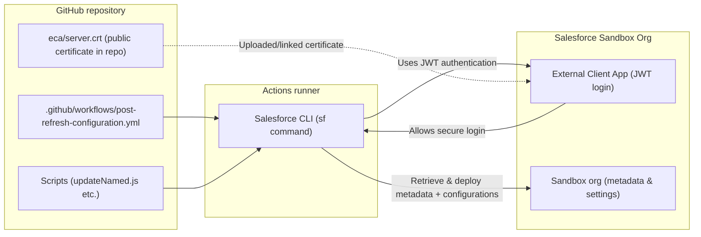
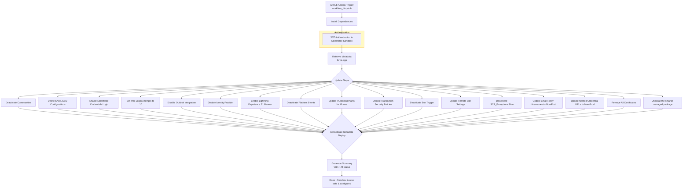

# Sandbox Refresh Automation — Setup Guide

This document provides an overview of the sandbox refresh post-configuration setup, including how GitHub Actions connects to Salesforce, the repository structure and how it is organized, how to manage GitHub secrets and variables, how to modify and extend workflows by adding steps, handling API versions, and the permissions required to run or update the workflow.

## High-level flow

The workflow runs in a **GitHub Actions** virtual environment. It installs the Salesforce CLI (`sf`), authenticates to the org using **JWT bearer flow**, then applies **retrieve → update → deploy** so the refreshed sandbox is safe and pointed at non-production endpoints.

## Post Refresh Configuration Flow

**Authentication (JWT)**

1. In Salesforce, an **External Client App** has **JWT Bearer Flow** enabled and the **public** certificate uploaded (see [ECA and `server.crt`](#eca-and-servercrt-external-client-app)).
2. In GitHub, the **private** key is stored as a secret (`SF_JWT_KEY`). The workflow writes it to a file (`server.key`) with restricted permissions.
3. The runner executes `sf org login jwt` using the **consumer key** (from the ECA), **username** (the user must exist in the sandbox and have the necessary permissions to update metadata), **private key file**, and **login/instance URL** (for sandboxes, `https://test.salesforce.com`).
4. Salesforce validates the JWT against the **public** cert on the app. The CLI then uses the authenticated session for **metadata retrieve/deploy**, **REST**, and **Tooling** calls.

---

## Repository Structure Overview

| Path | Purpose |
|------|--------|
| `.github/workflows/post-refresh-configuration.yml` | Main workflow and orchestration layer for the sandbox post-refresh process. Handles environment setup (e.g., Node/CLI installation), Salesforce JWT authentication, validation steps, metadata retrieval and updates, API-based operations, deployment, and job summary generation. It also wires GitHub secrets and variables into steps, pins tool versions, and controls execution through conditional logic (e.g., `workflow_dispatch` inputs like `enable_sf_credentials`, `update_named_credentials`). |
| `Scripts/NCupdated.js` | This javascript used after metadata retrieval (`force-app/main/default`). It scans for `*.namedCredential-meta.xml` files and updates endpoint URLs for both legacy and next-gen Named Credentials. Ensures production endpoints copied during sandbox refresh are replaced with non-production or pilot URLs. Supports configuration via GitHub variables/secrets such as `IGNORE_LIST` (to skip specific credentials) and `NAMED_CREDENTIALS_EXPLICIT_URLS` (explicit URL mappings). |
| `eca/server.crt` | Public certificate used for Salesforce JWT authentication via External Client App (ECA). This certificate is uploaded to Salesforce ECA. The corresponding private key is kept securely as a GitHub secret (e.g., `SF_JWT_KEY`). |
| *(GitHub Secrets & Variables)* | Used by the workflow for secure and dynamic configuration. Includes values such as `SF_CLIENT_ID` (consumer key from Salesforce ECA), `SF_USERNAME` (salesforce user with required permissions), `SF_JWT_KEY` (private key), and other configuration inputs like Named Credential mappings. Secrets must be securely maintained and never committed to the repository. |
| *(Salesforce External Client App - ECA)* | Configured in Salesforce to enable JWT-based authentication. Requires uploading `server.crt`, enabling JWT Bearer Flow, configuring OAuth scopes, and authorizing the user. The consumer key is stored as a GitHub secret (`SF_CLIENT_ID`). Key rotation involves updating both the repository certificate and GitHub secret. <Add link for ECA and cert rotation> |

---

## Required Access for Maintenance

People who modify workflows, scripts, or GitHub Actions configuration must have appropriate access to both the GitHub repository and the Salesforce org.

### GitHub (Recommended minimum: Maintain)

Assign user the **Maintain** role for this repository. This level of access allows users to:
- Read, clone, and push code  
- Manage GitHub Actions workflows  
- Configure repository settings such as secrets, variables, and branch protections  

Without Maintain (or Admin) access, the **Settings → Secrets and variables → Actions** section will be read-only or inaccessible.

### Salesforce

Users responsible for:
- Creating or maintaining the External Client App (ECA)  
- Uploading certificates  
- Having access to the required metadata so the workflow can retrieve, modify, and deploy changes successfully

must have appropriate **Salesforce admin-level access** in each target org.

This ensures that all required components (GitHub and Salesforce) can be properly maintained without permission-related blockers.

---

## Maintenance

### GitHub Actions — **repository variables**

Repository variables configuration (still protect them—do not put passwords here). Typical examples used by this automation:

| Variable | How to maintain |
|----------|------------------|
| `BASE_DOMAIN` | Update when org or domain naming conventions change and scripts reference it. |
| `EMAIL_RELAY_USERNAME` | Set to the **non-production** identity the Email Relay step should use after refresh. |
| `IGNORE_LIST` | Comma-/space-separated list of Named Credential. |
| `PKG_NAMESPACE` | Managed package namespace used to identify and uninstall a specific package (e.g., Smarsh). |
| `PLATFORM_EVENTS_LIST` | Update the list of platform events that need to be disabled. |
| `TSP_DISABLE_LIST` | Transaction Security Policy or related disable list—adjust when org policies change. |

**Where:** GitHub → **Settings → Secrets and variables → Actions → Variables**.

### GitHub Actions — **secrets**

| Secret | How to maintain |
|--------|------------------|
| `SF_JWT_KEY` | Private key PEM for JWT; rotate with ECA cert rotation; never commit to git. |
| `SF_CLIENT_ID` | ECA consumer key; update when you create the External Client App. |
| `SF_USERNAME` | Update the username to a user with the required permissions in the Salesforce sandbox. |
| `NAMED_CREDENTIALS_EXPLICIT_URLS` | Explicit Named Credential URL overrides; **update** when endpoints change. |

**Where:** **Settings → Secrets and variables → Actions → Secrets**.

### API version — `sfdx-project.json`

The project’s **`sourceApiVersion`** (in `sfdx-project.json`) defines the default Metadata API version for the operations. **Keep it aligned** with what the workflow and org support:

- When Salesforce releases new API versions, bump **`sourceApiVersion`** deliberately after testing retrieves/deploys.
- The workflow also reference explicit versions in **REST** (`/services/data/vXX.0/`) or **destructiveChanges** `package.xml` **version**—search the YAML for `v6` / `59.0` / `65.0` style pins and update them **together** when standardizing versions to avoid subtle mismatches.

---

## Adding a new automation step

1. **Prefer retrieve → update → deploy**  
   - `sf project retrieve start` for the metadata you need add to an existing retrieve step.  
   - Modify files under `force-app/main/default` with clear, reviewable changes (shell `sed`, scripts, or metadata transforms).  
   - `sf project deploy start --source-dir force-app` to apply.

2. **If that is impractical**, use the same patterns already in this repo:  
   - **Tooling API** (`curl` + JSON) for objects like `FlowDefinition` when a metadata deploy is heavy.  
   - **REST** (`curl` + `PATCH`/`POST`) for data or settings exposed as sObjects.  
   - **`Javascript`** (or a new script) for structured XML that is painful in shell—especially Named Credentials.

3. **Wire inputs and outputs**  
   - Add a `workflow_dispatch` input because the step should be optional.
   - Emit step outputs and include the step in the **deployment summary** section so operators see pass/fail alongside existing steps.

4. **Document new variables/secrets** in this file.

### External Client App (ECA)

For setup, configuration, and key rotation details, refer to the **Salesforce External Client App (ECA)** section in the [Repository Structure Overview](#repository-structure-overview).

Ensure that any changes to the External Client App (such as certificate updates, key rotation, or user authorization) remain in sync with the corresponding GitHub secrets (SF_CLIENT_ID, SF_JWT_KEY, SF_USERNAME) to avoid authentication failures.

<Add link for ECA and cert rotation>

---

## What the Workflow Does

### A) Environment Setup
- Triggered via **GitHub Actions (`workflow_dispatch`)**
- Installs required dependencies
- Prepares execution environment

---

### B) Authenticate to Salesforce (JWT via external client app)
- Performs **JWT-based authentication** to the Salesforce Sandbox
- Uses secure, non-interactive login suitable for automation

---

### C) Guardrail
- Ensures execution is restricted to **sandbox / non-production environments**
- Prevents accidental execution on production orgs

---

### D) Retrieve Metadata
- Retrieves metadata from:
  - `force-app`
- Pulls required configuration components for updates

---

### E) Apply Post-Refresh Configuration Changes
Each enabled step modifies metadata and updates Salesforce settings:

#### 1) Deactivate Communities
**What it does:** Disables Experience Cloud (Communities) sites.  
**Why:** Prevents public-facing endpoints from behaving like production.

#### 2) Delete SAML SSO Configurations
**What it does:** Removes all SAML-based SSO configurations.  
**Why:** Prevents accidental authentication through production identity providers.

#### 3) Enable Salesforce Credential Login
**What it does:** Enables username/password login by adjusting authentication settings.  
**Why:** SSO copied from production often fails or is unnecessary in sandbox.

#### 4) Set Max Login Attempts
**What it does:** Updates login policy to allow defined attempts (e.g., 10).  
**Why:** Aligns with non-prod needs.

#### 5) Disable Outlook Integration
**What it does:** Turns off Outlook/email integration features.  
**Why:** Prevents unintended connections to email systems.

#### 6) Disable Identity Provider
**What it does:** Disables Identity Provider (IdP) configurations.  
**Why:** Aligns with non-prod needs.

#### 7) Enable Lightning Experience S1 Banner
**What it does:** Updates Lightning banner settings.  
**Why:** Aligns with non-prod needs.

#### 8) Deactivate Platform Events
**What it does:** Disables selected platform event processes.  
**Why:** Prevents event-driven integrations from triggering in sandbox.

#### 9) Update Trusted Domains for iFrame
**What it does:** Modifies trusted domains configuration.  
**Why:** Ensures embedded content points to safe/non-prod domains.

#### 10) Disable Transaction Security Policies
**What it does:** Turns off transaction security rules.  
**Why:** Aligns with non-prod needs.

#### 11) Deactivate Box Trigger
**What it does:** Disables Box-related automation triggers.  
**Why:** Stops external integration activity in sandbox.

#### 12) Update Remote Site Settings
**What it does:** Rewrites remote site URLs to non-prod endpoints.  
**Why:** Ensures outbound callouts do not hit production systems.

#### 13) Deactivate SCA_Exceptions Flow
**What it does:** Deactivates the flow using API.  
**Why:** Prevents unintended automation execution in sandbox.

#### 14) Update Email Relay Usernames to Non-Prod
**What it does:** Updates email relay usernames via API.  
**Why:** Avoids sending emails through production infrastructure.

#### 15) Update Named Credential URLs to Non-Prod
**What it does:** Rewrites Named Credential endpoints using script.  
**Why:** Ensures integrations target sandbox systems only.

#### 16) Remove All Certificates
**What it does:** Deletes certificates using destructive deployment.  
**Why:** Removes production certificates that should not exist in sandbox.

#### 17) Uninstall Smarsh Managed Package
**What it does:** Removes the Smarsh managed package.  
**Why:** Aligns with non-prod needs.

---

### F) Consolidate Metadata Deploy
- Performs a **single consolidated deployment**
- Pushes all updated metadata back to the sandbox org

---

### G) Summary Output
- Generates a **status summary**
- Displays success/failure using ✅ / ❌ indicators

---

### H) Final State
After execution, the sandbox is:
- ✅ Safe  
- ✅ Cleaned  
- ✅ Fully configured for non-production use  

---

