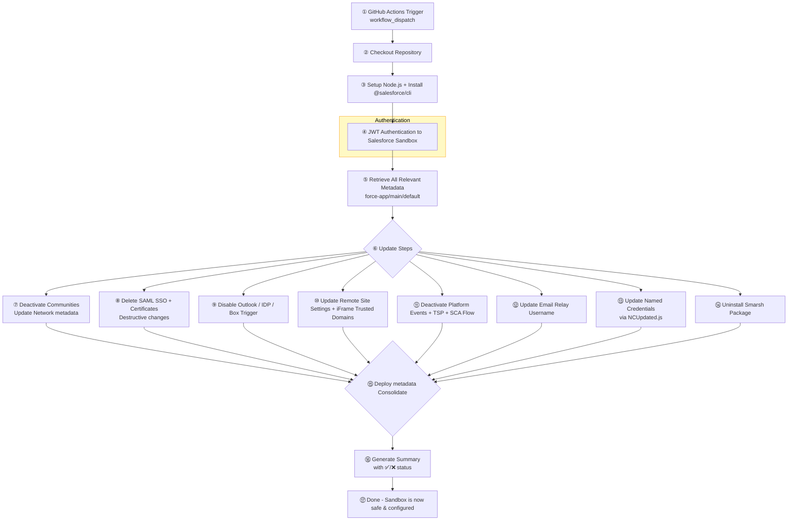

## 1. High-Level Process Flow

```mermaid
%%{init: {'flowchart': {'nodeSpacing': 28, 'rankSpacing': 40}}}%%
flowchart TD
    A["① GitHub Actions Trigger<br/>workflow_dispatch"]
    B["② Checkout Repository"]
    C["③ Setup Node.js + Install @salesforce/cli"]

    subgraph auth ["Authentication"]
        D["④ JWT Authentication to Salesforce Sandbox"]
    end

    E["⑤ Retrieve All Relevant Metadata<br/>force-app/main/default"]
    F{"⑥ Update Steps"}

    F1["⑦ Deactivate Communities<br/>Update Network metadata"]
    F2["⑧ Delete SAML SSO + Certificates<br/>Destructive changes"]
    F3["⑨ Disable Outlook / IDP / Box Trigger"]
    F4["⑩ Update Remote Site Settings + iFrame Trusted Domains"]
    F5["⑪ Deactivate Platform Events + TSP + SCA Flow"]
    F6["⑫ Update Email Relay Username"]
    F7["⑬ Update Named Credentials<br/>via NCUpdated.js"]
    F8["⑭ Uninstall Smarsh Package"]

    G{"⑮ Deploy metadata Consolidate"}
    H["⑯ Generate Summary<br/>with ✅/❌ status"]
    I["⑰ Done - Sandbox is now safe & configured"]

    A --> B --> C --> D --> E --> F

    F --> F1 & F2 & F3 & F4 & F5 & F6 & F7 & F8
    F1 & F2 & F3 & F4 & F5 & F6 & F7 & F8 --> G

    G --> H --> I

    style auth fill:#FFF9C4,stroke:#F9A825,color:#000
```
